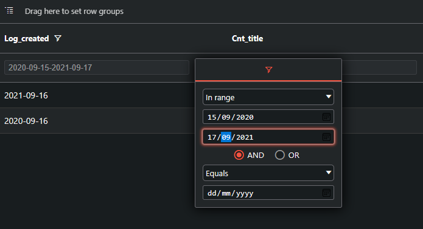
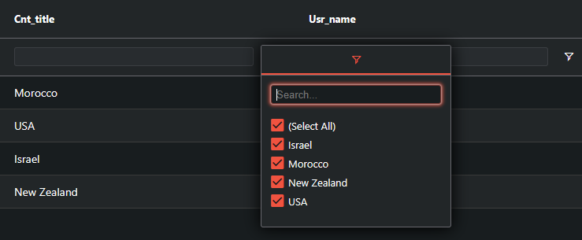

# Message Log

## Prerequisites
- PHP
- MySQL
- Composer
- Angular 11

## Installation
- clone repo
- cd server
- composer install
- mysql -u root -p
- mysql> create database message_log; 
- modify .env file (mySQL connection params)
- php artisan key:generate
- php artisan migrate:fresh --seed
- php artisan serve
- cd client 
- npm install
- npm run start

## Usage
- Date range picker:
    

- Country and User filters:
    

- The stored-procedure used within the logs query (And controller):
    server\database\db-routines\logs.sql

- The DB scheme and stored-procedure are being migrated
  (php artisan migrate:fresh --seed),
  And mock data is being seeded (server\database\data folder)